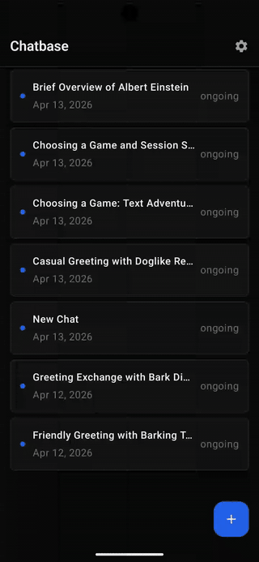

# Chatbase Android SDK Demo

A demo Android app showcasing the [Chatbase Android SDK](https://github.com/chatbase-co/chatbase-android). Built with Jetpack Compose and Material Design 3, it demonstrates real-time chat with AI agents, conversation history, tool calling, and user identification.

<p align="center">
  
</p>

## Prerequisites

- **Android Studio** Ladybug (2024.2.1) or newer
- **JDK 11+** (bundled with Android Studio)

## Quick Start

1. **Clone the repo:**
   ```bash
   git clone https://github.com/chatbase-co/android-demo.git
   ```

2. **Open in Android Studio** — open the `android-demo` folder as a project. The Chatbase SDK is pulled automatically from Maven Central.

3. **Run the app** — select an emulator or connected device and click **Run** (or press `Shift+F10`). Enter your Chatbase agent ID on the setup screen to connect.

## What the Demo Shows

| Feature | Description |
|---|---|
| **Chat** | Send messages and receive streaming AI responses |
| **Conversations** | List, create, and resume conversations with paginated history |
| **Tool Calling** | Renders tool call cards with input/output and execution status (requires a client-side custom action configured on the Chatbase dashboard — see below) |
| **User Identification** | JWT-based user identification via the Settings dialog |
| **Typing Indicator** | Animated indicator while the agent is responding |

## Tool Calling

The demo includes a `ToolCallCard` UI component that renders tool executions inline in the chat. To see tool calling in action:

1. **Create a client-side custom action** on the [Chatbase dashboard](https://www.chatbase.co) for your agent.
2. **Register the tool** in `AppViewModel.kt` using the SDK's `tool()` API. For example:
   ```kotlin
   client.tool("your_tool_name") { args ->
       // Your tool logic here
       mapOf("result" to "value")
   }
   ```
3. The SDK handles the rest — when the agent invokes the tool, the app displays a card showing the tool name, input arguments, execution progress, and output.

## Project Structure

```
app/src/main/java/com/chatbase/demo/
├── MainActivity.kt              # Entry point
├── ChatbaseApp.kt               # Application class
├── AppNavigation.kt             # Navigation graph
├── viewmodel/
│   ├── AppViewModel.kt          # SDK client lifecycle
│   └── ChatViewModel.kt         # Conversation state & message handling
└── ui/
    ├── SetupScreen.kt           # Agent ID input
    ├── ConversationsScreen.kt   # Conversation list
    ├── ChatScreen.kt            # Chat interface
    ├── SettingsDialog.kt        # Device ID, JWT identification
    ├── MessageBubble.kt         # Message display
    ├── MessageInput.kt          # Text input
    ├── ToolCallCard.kt          # Tool execution card
    └── TypingIndicator.kt       # Typing animation
```

## Build Details

| Property | Value |
|---|---|
| Min SDK | 24 (Android 7.0) |
| Target SDK | 35 |
| Kotlin | 2.2.20 |
| Compose BOM | 2025.01.01 |
| Java target | 11 |
